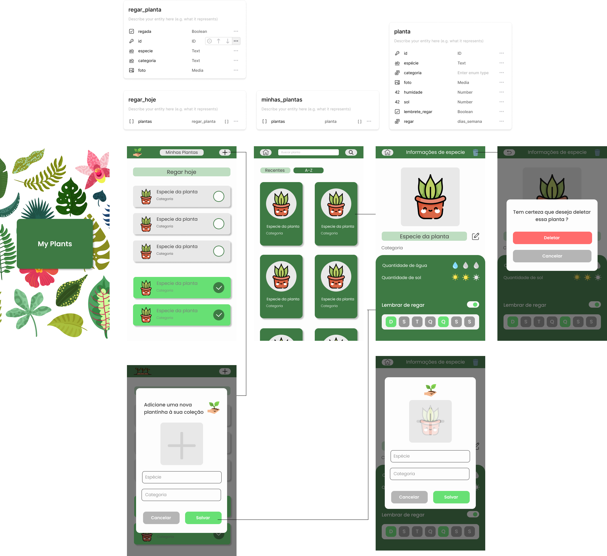

<a name="readme-top"></a>

<div align="center">

<h3 align="left"> My plants app</h3>

<p align="center">

Flutter app to store information about your plants and remember to water them.

<br />

<a link="https://www.figma.com/file/Knnqcp8DQxTJs8kyI3tHVT/myplants?node-id=216%3A2">
<h3 align="left">  Figma of project</h3> 
</a>


</div>

<br />

###  Built With

* [![Flutter][Flutter]][Flutter-url]

* [![Dart][Dart]][Dart-url]

<br />

###  Dependencies

* <a link="[sqflite | Flutter Package (pub.dev)](https://pub.dev/packages/sqflite)">sqflite</a>
* <a link="[sqflite | Flutter Package (pub.dev)](https://pub.dev/packages/sqflite)">flutter_rating_bar</a>
* <a link="[image_picker | Flutter Package (pub.dev)](https://pub.dev/packages/image_picker)">image_picker</a>
* <a link="[path_provider | Flutter Package (pub.dev)](https://pub.dev/packages/path_provider)">path_provider</a>


###  Getting Started


1. Install [Flutter](https://flutter.dev)

2. Clone the repo

```sh

git clone https://github.com/karoldm/myplants.git

```

3. Get dependencies

```sh

flutter pub get

```

3. Run app

```sh

flutter run

```

<p align="right">(<a href="#readme-top">back to top</a>)</p>

<!-- MARKDOWN LINKS & IMAGES -->


[linkedin-shield]: https://img.shields.io/badge/-LinkedIn-black.svg?style=for-the-badge&logo=linkedin&colorB=555

[linkedin-url]: https://linkedin.com/in/karoldm

[Flutter]: https://img.shields.io/badge/Flutter-%2302569B.svg?style=for-the-badge&logo=Flutter&logoColor=white

[Flutter-url]: https://flutter.dev/

[Dart]: https://img.shields.io/badge/dart-%230175C2.svg?style=for-the-badge&logo=dart&logoColor=white

[Dart-url]: https://dart.dev/