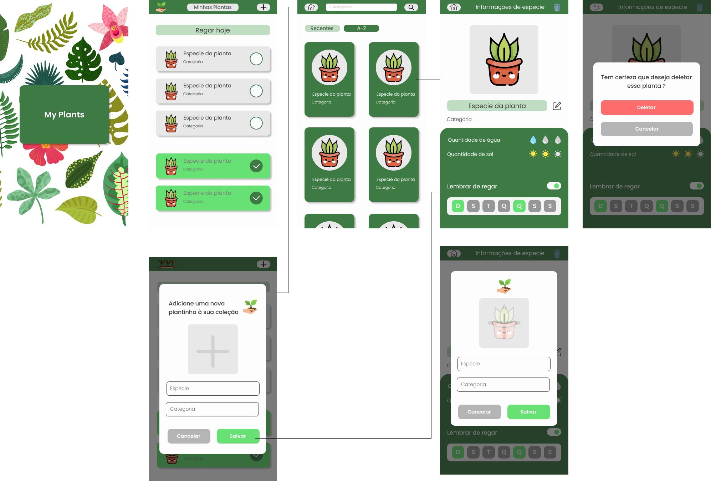

<a name="readme-top"></a>
<br />

<div align="left">

<h3 align="left">My plants app </h3>

<p align="left">

Flutter app to store information about your plants and remember to water them.

<br />

### [Figma Project][Figma-url]

<br />
<br />



<br />
<br />

### Built With

- [![Flutter][Flutter]][Flutter-url]

- [![Dart][Dart]][Dart-url]

<br />

### Dependencies

- [sqflite][Sqflite-url]
- [flutter_rating_bar][Flutter_rating_bar-url]
- [image_picker][Image_picker-url]
- [path_provider][Path_provider-url]

<br />

### Getting Started

1. Install [Flutter](https://flutter.dev)

2. Clone the repo

```sh

git clone https://github.com/karoldm/myplants.git

```

3. Get dependencies

```sh

flutter pub get

```

3. Run app

```sh

flutter run

```

<p align="right">(<a href="#readme-top">back to top</a>)</p>

<!-- MARKDOWN LINKS & IMAGES -->

[linkedin-shield]: https://img.shields.io/badge/-LinkedIn-black.svg?style=for-the-badge&logo=linkedin&colorB=555
[linkedin-url]: https://linkedin.com/in/karoldm
[Flutter]: https://img.shields.io/badge/Flutter-%2302569B.svg?style=for-the-badge&logo=Flutter&logoColor=white
[Flutter-url]: https://flutter.dev/
[Dart]: https://img.shields.io/badge/dart-%230175C2.svg?style=for-the-badge&logo=dart&logoColor=white
[Dart-url]: https://dart.dev/
[Figma-url]: https://www.figma.com/file/Knnqcp8DQxTJs8kyI3tHVT/myplants?node-id=216%3A2
[Figma]: https://cdn-icons-png.flaticon.com/512/5968/5968705.png
[Path_provider-url]: https://pub.dev/packages/path_provider
[Sqflite-url]: https://pub.dev/packages/sqflite
[Flutter_rating_bar-url]: https://pub.dev/packages/flutter_rating_bar
[Image_picker-url]: https://pub.dev/packages/image_picker
